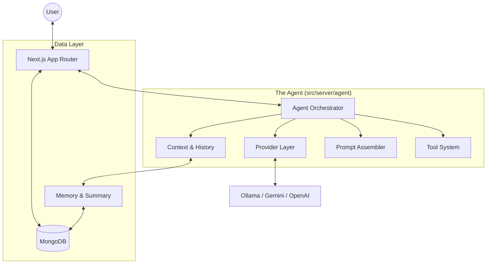

# 🏗️ Architecture Overview

Maya AI is built with a modular, event-driven architecture that prioritizes extensibility, performance, and a "human-like" interaction flow. This document details the core layers of the application.

---

## 🗺️ High-Level Architecture

Maya operates as a bridge between the user and multiple AI models, enhanced by persistent memory and a rich tool ecosystem.

---

## 🧠 The Agent (`src/server/agent`)

The core logic resides in `src/server/agent`, where the **Pipeline-First Architecture** transforms raw user input into a stream of agentic responses.

### The 7 Layers of the Pipeline

1.  **Provider Layer** (`provider/`): Centralizes API key resolution and client instantiation. It normalizes all external AI services (Ollama, OpenAI, Gemini) into a unified interface.
2.  **Context Layer** (`context/`): Handles settings resolution, chat history loading, and vision preprocessing. It decides what the AI "knows" about the current session.
3.  **Prompt Layer** (`prompt/`): Assembles the final system and user prompts using a modular builder pattern (Base, Rules, Tools, Persona, Memory).
4.  **Memory Layer** (`memory/`): Manages long-term summarization and transient memory retrieval to keep the AI focused on the user's intent.
5.  **Tool Layer** (`tools/`): A decoupled ecosystem of modular capabilities (Web Search, Weather, etc.) with a standardized registration and execution flow.
6.  **Stream Layer** (`stream/`): Orchestrates the delivery of results back to the client using a specialized event-emitter for text chunks and tool status updates.
7.  **Orchestrator** (`orchestrator.ts`): The "brain" that runs the main loop, handling tool-call iterations and streaming coordination.

### 🔄 Unified Tool Registry
Tools are no longer ad-hoc exports. They are formally registered in `tools/registry.ts`, ensuring a consistent shape for both the LLM schema and the execution logic.

### 👁️ Simplified Vision Flow
Maya uses a **"Vision via Tool"** approach. Images in history are replaced with tool-call placeholders, delegating all visual analysis to the `image-analyze` tool which handles provider fallbacks automatically.

---

## 🎨 Frontend Architecture

Maya's UI is designed for "Visual Excellence" and responsiveness.

- **Next.js 16 (App Router)**: Leverages Server Components for fast initial loads and Client Components for interactive chat.
- **Tailwind CSS v4**: Uses the latest CSS-in-JS features and custom theme variables (`globals.css`).
- **Framermotion**: Powers smooth transitions, shimmers, and micro-animations.
- **Shadcn UI**: Provides a clean, accessible foundation for all UI elements.

---

## 🗄️ Data & Persistence

- **MongoDB**: The primary database for storing:
  - **Conversations**: Full message history and metadata.
  - **Settings**: Per-user configuration for models, tools, and appearance.
  - **Memories**: Extracted long-term knowledge about the user.
- **NextAuth**: Handles secure session management and authentication via a custom **Credentials** provider (Email/Password).

---

## 📡 Event Flow (A Single Chat)

1. **User Sends Message**: The frontend initiates a POST request to `/api/chat`.
2. **Pipeline Starts**: The backend resolves the user's settings and active model.
3. **History Stage**: Maya checks if a summary is needed and prepares the message history.
4. **LLM Call**: The model receives the context and tools.
5. **Tool Execution (Optional)**: If the model calls a tool, the pipeline pauses, executes the tool, and feeds the result back into the LLM.
6. **Streaming Response**: Final content and tool events are streamed to the client using Server-Sent Events (SSE).

---

> [!NOTE]
> For details on how to add new tools, refer to the **[Extending Maya](./extending-maya.md)** guide.
