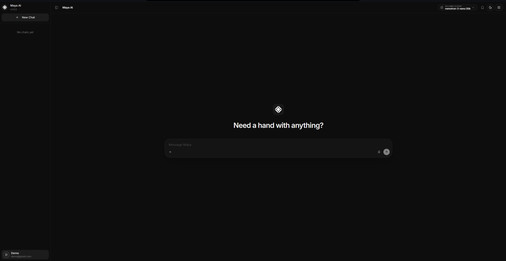

# 🚀 Getting Started with Maya AI

Welcome to the future of agentic AI. **Maya AI** is a high-performance, extensible AI assistant built with Next.js 16, designed to reason, search, and execute tasks with precision.



---

## 🛠️ Prerequisites

Before you dive in, ensure you have the following installed on your machine:

- **Node.js**: v18.17 or higher (v20+ recommended)
- **MongoDB**: A local instance or a MongoDB Atlas connection string
- **Package Manager**: `npm`, `yarn`, or `pnpm`

---

## 📥 Installation

Follow these steps to get Maya AI up and running locally:

### 1. Clone the Repository
```bash
git clone https://github.com/DushyantKumardev/maya-ai.git
cd maya-ai
```

### 2. Install Dependencies
```bash
npm install
```

### 3. Configure Environment Variables
Copy the `.env.example` file to `.env` and fill in your credentials:

```bash
cp .env.example .env
```

For a complete breakdown of all configuration options and security details, see the **[Environment Variables Guide](./environment-variables.md)**.

| Variable | Description |
| :--- | :--- |
| `MONGODB_URI` | Your MongoDB connection string |
| `MAYA_ENCRYPTION_KEY` | Key for encrypting sensitive data (AES-256-GCM) |
| `AUTH_SECRET` | A random string for session encryption (Auth.js) |

---

## 🚀 Running the App

Once configured, start the development server:

```bash
npm run dev
```

Open [http://localhost:3000](http://localhost:3000) in your browser to meet Maya.

---

## 📁 Project Structure

Maya AI follows a modern, modular architecture:

- **[`src/app`](../src/app)**: Next.js App Router (Pages, Layouts, API Routes)
- **[`src/server/ai`](../src/server/ai)**: The "Brain" of Maya. Contains server-side logic for AI providers, chat logic, streaming events, tools, and memory logic.
- **[`src/components`](../src/components)**: Shared Ui components used across the application, powered by Shadcn UI and Tailwind CSS v4.
- **[`src/features`](../src/features)**: Core application features (Chat, Settings etc).
- **[`src/lib`](../src/lib)**: Shared utilities and constants.

---

## 🛡️ Next Steps

Now that you're set up, explore the following:

- **[Extending Maya](./extending-maya.md)**: Learn how to add new tools and capabilities.
- **[Architecture Overview](./architecture.md)**: Deep dive into Maya's internal workings.
- **[Prompts](./prompts.md)**: Details on the Prompt Engineering layer.
- **[UI Documentation](./ui.md)**: Overview of components, widgets, and layout.
- **[API Reference](./api-reference.md)**: Details on internal API endpoints and schemas.
- **[Constants](./constants.md)**: Global configuration and service registry.
- **[Security & Privacy](./security.md)**: How we handle your data and encryption.
- **[Styling Guide](./styling-guide.md)**: Best practices for Tailwind CSS v4 and UI.

---

> [!NOTE]
> Maya AI is built on a **local-first** philosophy, prioritizing privacy and performance for private development. While optimized for local LLMs via Ollama, it offers seamless integration with industry-leading providers including Gemini, OpenAI, Anthropic, OpenRouter and Ollama Cloud.

---

> [!TIP]
> Maya AI uses **Tailwind CSS v4**. Make sure your IDE extensions are up to date for the best developer experience!
